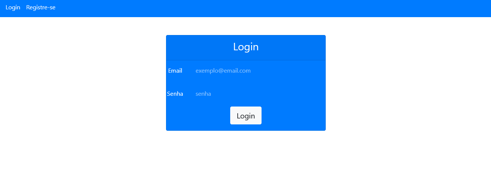
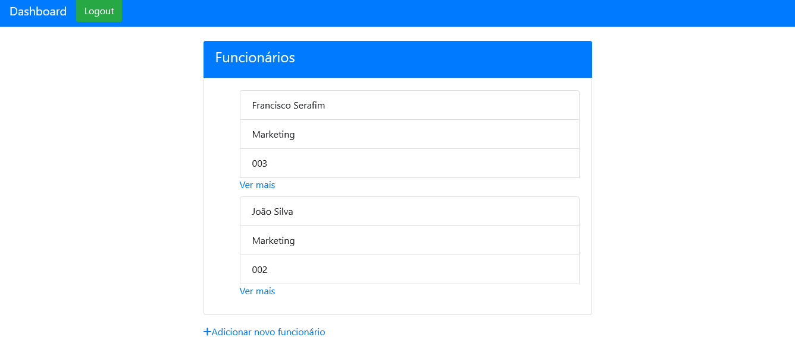
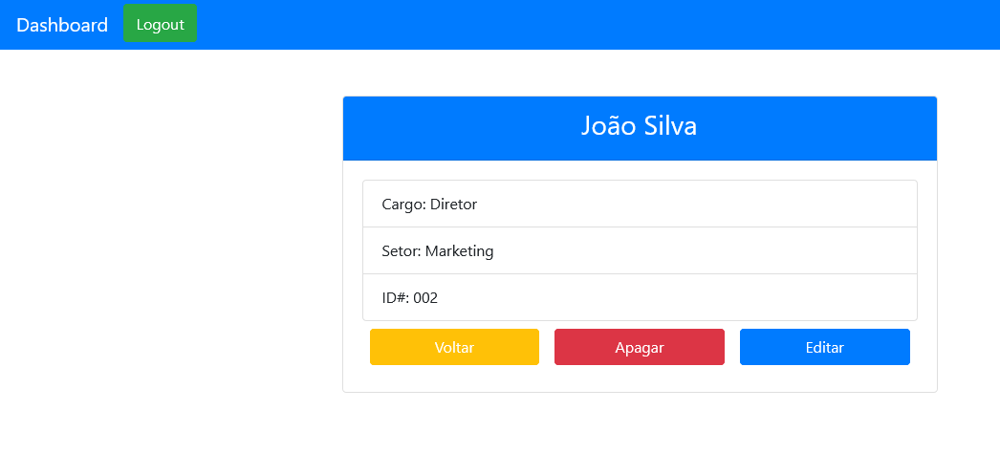
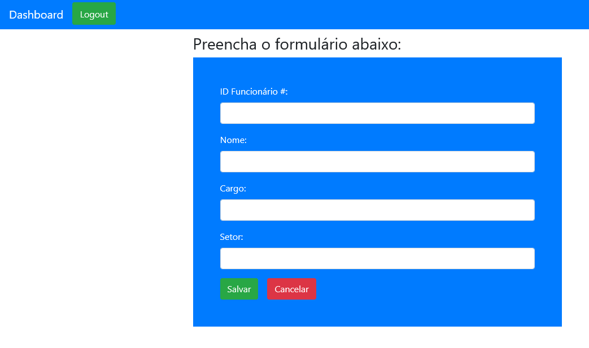
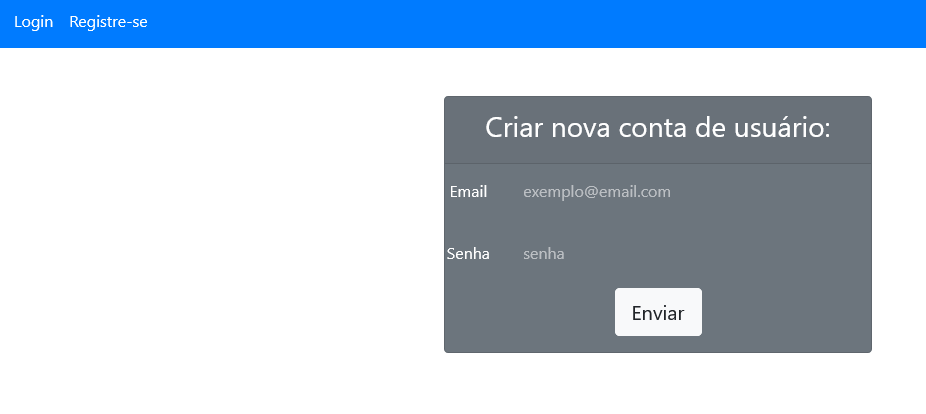

## Table of contents

- [Overview](#overview)
  - [Screenshot](#screenshot)
  - [Links](#links)
- [My process](#my-process)
  - [Built with](#built-with)
  - [What I learned](#what-i-learned)
- [Project Setup](#project-setup)

## Overview

### Screenshot




 

## My process

I tried to create a simple, but efficient, system, that could manipulate the data and create new users with authentication.  

### Built with

- Semantic HTML5 markup
- CSS custom properties
- Bootstrap
- Vue.js
- Firebase

### What I learned

That wasn't a easy project for me, but i'm very proud for the result. I learn a lot how to manipulate data with javascript promises, create routes and guards, also how to validate the system.

## Project setup
```
npm install
```

### Compiles and hot-reloads for development
```
npm run serve
```

### Compiles and minifies for production
```
npm run build
```

### Customize configuration
See [Configuration Reference](https://cli.vuejs.org/config/).
